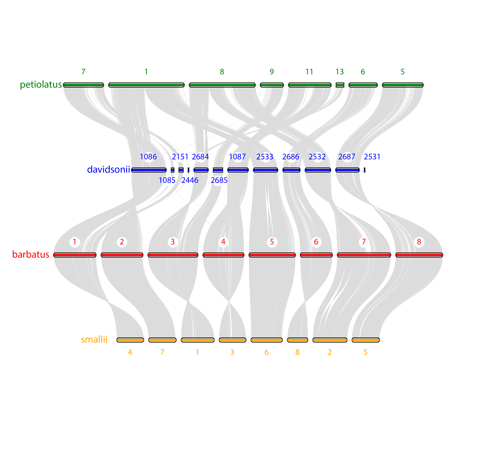

# 1. Install jcvi

I ended up using installation of jcvi on my laptop.
steps for installation:
```
conda env create -n jcvi
conda activate jcvi
conda install pip
pip install jcvi
```

# 2. Install LAST
Conda install will not work with jcvi for some reason. Last can be found [here](https://gitlab.com/mcfrith/last). After using makefile, copy files in last/bin to software bin and add to PATH variable
```
cp * /Users/benstone/software
sudo echo /Users/benstone/software >> /etc/paths
```

# 3. Install Latex
LaTex can be found [here](https://www.latex-project.org/get/).


# 4. Preparing input files
We need genome.fa files and .gff3 files for each of the reference genomes of interest.
a. Use [`python script`](/general_scripts/filter_single_isoform_scaflength_conditional.py) to filter down to a single (longest) isoform/mRNA for each gene model. Input: genome.gff3

* Note: new option (6/1/23) to additionally include a fasta.fai and minimum length parameter to filter out genes on scaffolds shorter than the minimum length threshold. E.g., `python filter_single_isoform_scaflength_conditional.py infile.gff outfile.gff infile_genome.fai 100000` would additionally filter all genes on scaffolds shorter than 100kbp.

```shell
#for barbatus:
python filter_single_isoform_scaflength_conditional.py M4_annotation_putative_function_domain_added_blast_tomato.genemodels.noseq.gff single_isoform_barbatus_M4_annotation.gff


#for davidsonii:
#first use preliminary script to keep only genemodels and related functions
python keep_maker_genemodels.py annot_Pdavidsonii_genome_FUNCTIONAL-INCLUDED.gff annot_Pdavidsonii_genome_FUNCTIONAL-INCLUDED.genemodels.gff

python filter_single_isoform_scaflength_conditional.py annot_Pdavidsonii_genome_FUNCTIONAL-INCLUDED.genemodels.gff single_isoform_davidsonii_FUNCTIONAL-INCLUDED.gff


#for petiolatus:
python keep_maker_genemodels.py Rnd1.all.maker.snapdragon.noseq.gff Rnd1.all.maker.snapdragon.noseq.genemodels.gff

python filter_single_isoform_scaflength_conditional.py Rnd1.all.maker.snapdragon.noseq.genemodels.gff single_isoform_petiolatus.gff


#for smallii:
python filter_single_isoform_scaflength_conditional.py smallii_NAMECHANGE_final_annotation.gff single_isoform_smallii_NAMECHANGE.gff
```

b. Make .bed, protein.fasta, and nucleotide.cds files for each genome
Additionally this filters CDS with premature stop codons. You will need the python package [`gffread`](https://anaconda.org/bioconda/gffread)

```shell
#for barbatus:
gffread single_isoform_barbatus_M4_annotation.gff --bed --keep-genes --sort-alpha -o single_isoform_barbatus_M4_annotation-genes.bed

gffread -y single_isoform_barbatus_M4_annotation-protein-CMKEVH.fasta -x single_isoform_barbatus_M4_annotation-nucleotide-CMKEVH.cds -C -M -K -E -V -H --sort-alpha -g Pbar.2022.LG.fa single_isoform_barbatus_M4_annotation-genes.bed


#for davidsonii:
gffread single_isoform_davidsonii_FUNCTIONAL-INCLUDED.gff --bed --keep-genes --sort-alpha -o single_isoform_davidsonii_FUNCTIONAL-INCLUDED-genes.bed

gffread -y single_isoform_davidsonii_FUNCTIONAL-INCLUDED-protein-CMKEVH.fasta -x single_isoform_davidsonii_FUNCTIONAL-INCLUDED-nucleotide-CMKEVH.cds -C -M -K -E -V -H --sort-alpha -g annot_Pdavidsonii_genome.fasta single_isoform_davidsonii_FUNCTIONAL-INCLUDED-genes.bed


#for petiolatus:
gffread single_isoform_petiolatus.gff --bed --keep-genes --sort-alpha -o single_isoform_petiolatus-genes.bed

gffread -y single_isoform_petiolatus-protein-CMKEVH.fasta -x single_isoform_petiolatus-nucleotide-CMKEVH.cds -C -M -K -E -V -H --sort-alpha -g petiolatus_genome.fasta single_isoform_petiolatus-genes.bed


#for smallii:
gffread single_isoform_smallii_NAMECHANGE.gff --bed --keep-genes --sort-alpha -o single_isoform_smallii_NAMECHANGE-genes.bed

gffread -y single_isoform_smallii_NAMECHANGE-protein-CMKEVH.fasta -x single_isoform_smallii_NAMECHANGE-nucleotide-CMKEVH.cds -C -M -K -E -V -H --sort-alpha -g smallii_NAMECHANGE_PGA_assembly.fasta single_isoform_smallii_NAMECHANGE-genes.bed


#for kunthii:
gffread single_isoform_kunthii_gemoma_barbref_NEWNAME.gff --bed --keep-genes --sort-alpha -o single_isoform_kunthii_gemoma_barbref_NEWNAME-genes.bed

gffread -y single_isoform_kunthii_gemoma_barbref_NEWNAME-protein-CMKEVH.fasta -x single_isoform_kunthii_gemoma_barbref_NEWNAME-nucleotide-CMKEVH.cds -C -M -K -E -V -H --sort-alpha -g kunthii.genome.1mbp_NEWNAME.fasta single_isoform_kunthii_gemoma_barbref_NEWNAME-genes.bed

```


We should now have single-isoform bedfiles and the respective fasta sequence files for all of the genomes of interest. *Note that I subsequently copied these output bed files into a new directory, and changed file names to be more concise*


# 5. Running MCscan (Python version) implementation of jcvi
These steps will mirror closely those found in the jcvi [manual](https://github.com/tanghaibao/jcvi/wiki/MCscan-(Python-version)). I am currently setting up barbatus and davidsonii as the "central" genomes, as they are probably the two most complete genomes +annotated assemblies.
```
conda activate jcvi

#create anchors files and dotplots
python -m jcvi.compara.catalog ortholog barbatus davidsonii --cscore=.95 --dbtype=nucl
python -m jcvi.compara.catalog ortholog barbatus smallii --cscore=.95 --dbtype=nucl
python -m jcvi.compara.catalog ortholog davidsonii petiolatus --cscore=.95 --dbtype=nucl


#extract subsets of blocks from anchorfile
python -m jcvi.compara.synteny screen --simple barbatus.davidsonii.anchors barbatus.davidsonii.anchors.new
python -m jcvi.compara.synteny screen --simple barbatus.smallii.anchors barbatus.smallii.anchors.new
python -m jcvi.compara.synteny screen --simple davidsonii.petiolatus.anchors davidsonii.petiolatus.anchors.new


#after organizing the seqids.txt and layout.txt files...
python -m jcvi.graphics.karyotype seqids.txt layout.txt -o karyotype_barbatus.davidsonii.petiolatus.smallii.pdf

```

And here is the finished product!


