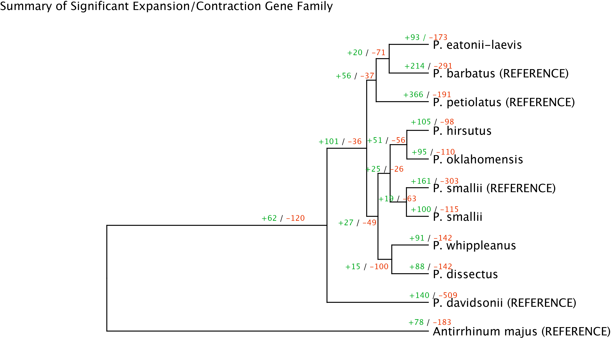

## Orthogroup Identification with OrthoFinder
The scripts and files herein represent the input sequences and scripts used to run orthofinder.

* Run the script [`run_orthofinder_penstemon_comparative.sh`](run_orthofinder_penstemon_comparative.sh) after installing [OrthoFinder](https://github.com/davidemms/OrthoFinder).

_ANALYSIS NOTES_
- Analysis run on nucleotide.cds files, though perhaps protein input files would be better
- Perhaps pre-filtering the input fastas even further, to only include gene models on scaffolds >50kb (or some similar threshold) would be a wise decision.


## Assessing gene family evolution with CAFE5
Next we will use some of the Orthofinder output as input for [CAFE](https://github.com/hahnlab/CAFE5) analysis.

1. data file containing gene family sizes for taxa included in the tree
This is obtained from orthofinder output -- Orthogroups/Orthogroups.GeneCount.tsv

```
#format Orthofinder output into CAFE format:
#Change first column header to Desc, and values to (null). Remove last column.

awk -F'\t' '{print "(null)\t"$0}' Orthogroups.GeneCount.tsv | \
 awk -F'\t' 'NR==1 {$1="Desc"} {NF--} 1' | rev | sed 's/^\s*//g' | rev | tr ' ' '\t' > unfiltered_cafe_input.txt

```

2. filter gene families in which one or more species have >= 100 gene copies
* Uses [`clade_and_size_filter.py`](clade_and_size_filter.py) from the CAFE5 tutorial.
```
python clade_and_size_filter.py -i unfiltered_cafe_input.txt -o filtered_cafe_input.txt -s
```

3. Generate ultrametric rooted Newick-formatted tree, including branch lengths
* Note: Currently this uses the Orthofinder output tree for simplicity, but in the future I will use a more robustly estimated species tree
```
Rscript R make_ultrametric.R
```

4. run CAFE
Estimate models with different numbers of rate categories
* Note that the publication suggests testing at least K = 3-4 for empirical data sets.

```
cafe5 -i filtered_cafe_input.txt -t calibrated_species_tree.tre -k 1 -o k1
cafe5 -i filtered_cafe_input.txt -t calibrated_species_tree.tre -k 2 -o k2
cafe5 -i filtered_cafe_input.txt -t calibrated_species_tree.tre -k 3 -o k3

```

5. conduct likelihood ratio test to determine which number of rate categories is best
_Still need to do this_
```


#to determine how many and which families underwent significant expansions/contractions:
#for example, with a single rate category

grep -c "\ty" Base_family_results.txt
grep "y" Base_family_results.txt > Significant_families.txt
```


6. generate plot of cafe results
* Note: uses [`CafePlotter`](https://github.com/moshi4/CafePlotter)

```
cafeplotter -i k1 -o k1_cafe_plots --format svg --expansion_color 'green' --contraction_color 'red'

```

This will also require a bit of post-product editing in Illustrator (the internal branches are too short and the figure is hard to read). Here is the final product!


